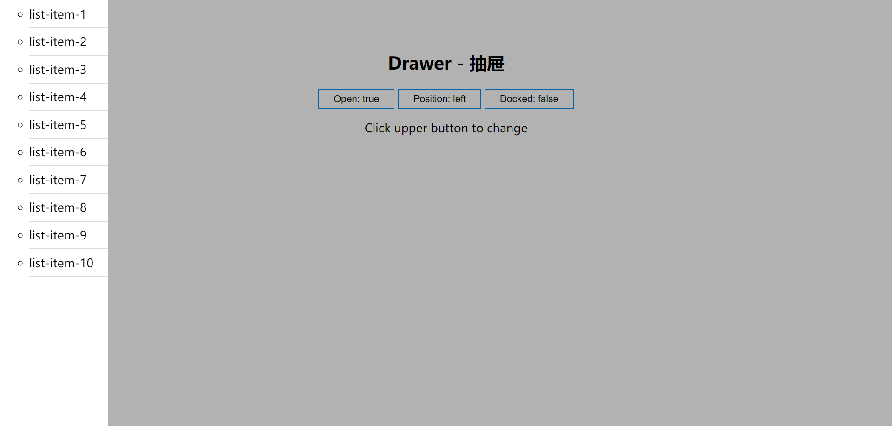

# v-drawer
[](https://travis-ci.org/liujian10/v-drawer)



## Install

[](https://npmjs.org/package/v-drawer)

## Development

```bash
# install
npm install --save v-drawer

# run
npm run dev

# build
npm run build
```

## Example

local: http://localhost:3002/

online: http://mapleliu.com/v-drawer/

## Usage

```js
import Vue from 'vue';
import VDrawer from 'v-drawer';

Vue.component(VDrawer.name, VDrawer);
```

## API

### props

| 参数 | 说明 | 类型 | 默认值 | 可选值 |
|-----------|-----------|-----------|-------------|-------------|
| position | 抽屉所在位置 | `String` | `left` | `left`,`right`,`top`,`bottom` |
| open | 抽屉是否展开 | `Boolean` | - |
| docked | 抽屉是否嵌入文档 | `Boolean` | - |
| sidebar-style | 侧边栏样式 | `String` `Object` | - | - |
| overlay-style | 遮罩层样式 | `String` `Object`| - | - |
| content-style | 抽屉内容样式 | `String` `Object`| - | - |
| forbid-click | 禁止背景点击 | `Boolean` | `false` | - |
